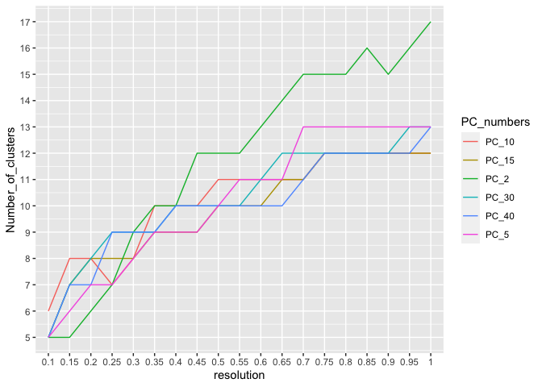
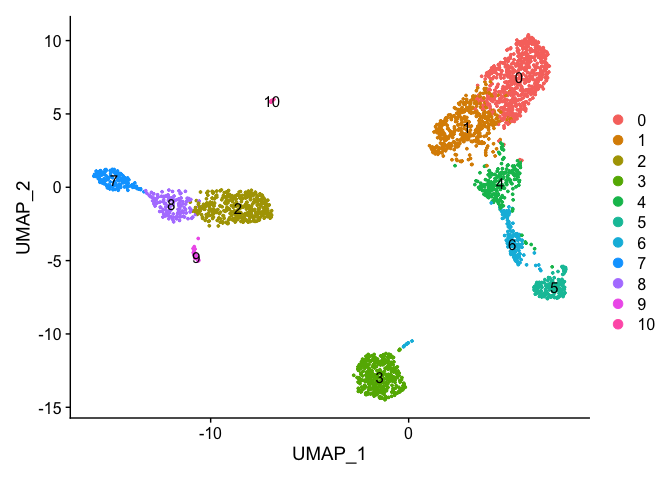

Exploring the effect of setting principal components and resolutions in
defining UMAP embedding and cell cluster identification in Seurat
================

# Problem

In scRNAseq analysis, a major hyperparameter tuning step when using
`Seurat` is, selecting the principal components (PC) in the
`FindNeighbors(..., dims = ___ )` and the resolution in
`FindClusters(...,resolution = ___ )` functions. Depending upon the
data, this parameter optimization can be very tedious, as there is no
consensus for setting a specific value for these. Because ultimately,
these two values in these two functions can dramatically change the cell
embedding/projection in the UMAP plot and the number of clusters. And
based on the number of cell clusters, further analysis such as, cell
marker gene identification, renaming the cell clusters number to an
actual cell name, and performing further down-stream analysis like
differential cell type abundance or differential expression among cell
clusters. Of course, one can take a look at the ElbowPlot() and see at
which PC, the standard deviation is the lowest. But sometimes, it is
good to test out all the different PCs and resulting cell clusters from
it in a iterative approach.

# Solution:

One idea can be, to check all possible combinations of PCS and
resolutions simulatneously, to see how many cell clusters appear in the
data. From this, the researcher can make a more informed decision on
testing and selecting these two parameters.

### Disclaimer

Input raw data(stored here in this repo in `data` folder), code for
preprocessing Seurat object were based on this [Seurat
Vignette](https://satijalab.org/seurat/articles/pbmc3k_tutorial.html)

Lets load some R libraries

``` r
library(glmGamPoi)
library(tidyverse)
library(Seurat)
library(patchwork)
library(ggplot2)
```

### Load the PBMC dataset

``` r
pbmc.data <- Read10X(data.dir = "data/filtered_gene_bc_matrices/hg19/")
pbmc <- CreateSeuratObject(counts = pbmc.data, project = "pbmc3k", min.cells = 3, min.features = 200)
```

### Standard pre-processing workflow

Lets stash the mitochondrial reads into the seurat objet, which will be
used to regress out this effect. We use `glmGamPoi` in the `SCTransform`
to make it run faster.

``` r
pbmc[["percent.mt"]] <- PercentageFeatureSet(pbmc, pattern = "^MT-")
pbmc <- SCTransform(pbmc, method = "glmGamPoi", vars.to.regress = "percent.mt", verbose = FALSE) #
pbmc <- RunPCA(pbmc, verbose = FALSE)
```

Our minimal standard preprocessing of the data is done. Of course, one
can perform further preprocessing, by filtering out low quality cells by
only taking cells with read counts(`nCount_RNA`) or genes detected per
cell (`nFeature_RNA`). But for quick demonstration purpose, we move
directly to the KNN embedding, and cell clustering exploration.

# Line plot for different PCs and resolutions

Let’s set some PCs to test. Typically, by using SCTransform, it has been
suggested that the number of PCs should have little impact on cell
cluster identificatio. Here, we select 6 different PCs to
test(`2,5,10,15,30,40`).

Also, for resolutions to be tested, we select 19 different resolutions
ranging from 0.1 to 1, with 0.05 increments(e.g. 0.1, 0.15, 0.20, etc).

``` r
PCs= c(2,5,10,15,30,40) ##set which PCs for embedding
tested.resolutions <- seq(0.1,1, by = 0.05) ##set which resolutions for clustering
PCs.cluster.numbers = list() # list for saving the dataframes.  
```

Now, lets run a for loop for each of those `PCs`.

``` r
for(i in PCs){
  pbmc <- FindNeighbors(object = pbmc, dims = 1:i)
  # Determine the clusters for various resolutions.
  pbmc <- FindClusters(object = pbmc,resolution = tested.resolutions)
  
  #getting the metadata
  resolutions_clusters =  select(pbmc@meta.data, contains("SCT_snn_res")) 
  #data cleaning and wrangling
  resolutions_clusters[] = lapply(resolutions_clusters, as.numeric)
  resolutions_clusters.summary=data.frame(apply(resolutions_clusters,2,max))
  colnames(resolutions_clusters.summary) = paste0("PC_",i)
  resolutions_clusters.summary$resolution = rownames(resolutions_clusters.summary)
  resolutions_clusters.summary$resolution = gsub("SCT_snn_res.","",as.character(resolutions_clusters.summary$resolution))
  resolutions_clusters.summary = resolutions_clusters.summary %>% arrange(as.numeric(resolution))
  resolutions_clusters.summary$resolution <- factor(resolutions_clusters.summary$resolution, levels = resolutions_clusters.summary$resolution)
  PCs.cluster.numbers[[paste0("PC_",i)]] = resolutions_clusters.summary
  print(paste0("PC_",i," dataframe saved!")) # a small note to print after each loop for debugging if the forloop fails.
}
```

``` r
#using reduce() from tidyverse::purrr to join multiple dataframes into one single dataframe, then gathering the columns with different PCs and the no. of clusters into two columns:
PCs.cluster.numbers.df = PCs.cluster.numbers %>% reduce(left_join, by = "resolution") %>% gather(-resolution, key = "PC_numbers", value = "Number_of_clusters")
```

# Now, lets make the plot

``` r
#line plot for all those PCs and their corresponding number of clusters, for the defined resolutions. 
ggplot(PCs.cluster.numbers.df) + geom_line(aes(x = resolution, y = Number_of_clusters,group = PC_numbers, colour = PC_numbers)) +  scale_y_continuous(breaks = seq(4, 20, by = 1))
```

<!-- -->

``` r
#ggsave("plots/resolutions-combined-4diff.PCS.pdf", height = 5, width = 6)
```

Of course, as this is a small dataset, the plot looks a bit awkward! But
lets look at some patterns.

1.  No matter the PCs, under resolution &lt; 0.4, they are giving
    similar number of cell clusters, ranging from 5-10 cell clusters.
2.  PC = 2 (green line) deviates the most in terms of number of clusters
    identified with increasing resolutions. In the source vignette, 10
    PCs and 0.5 resolutions were used. Although they did not do
    `SCTransform()`(rather a standard Log normalization and scaling),
    therefore, they found 9 clusters, whereas, we find 11 clusters. As
    `SCTransform()` is the latest and more accurate normalization
    procedure, we will follow it.
3.  Finally, we can make the UMAP plot to see how the cells are
    clustered.

``` r
# Assign the PC to 10 and final resolution to 0.5, like the source vignette
pbmc <- FindNeighbors(object = pbmc, dims = 1:10)
# Determine the clusters for various resolutions.
pbmc <- FindClusters(object = pbmc,resolution = 0.5)
```

    ## Modularity Optimizer version 1.3.0 by Ludo Waltman and Nees Jan van Eck
    ## 
    ## Number of nodes: 2700
    ## Number of edges: 93050
    ## 
    ## Running Louvain algorithm...
    ## Maximum modularity in 10 random starts: 0.8911
    ## Number of communities: 11
    ## Elapsed time: 0 seconds

``` r
pbmc <- RunUMAP(pbmc, dims = 1:10)
```

Just like the line plot, we also see, there are 11 cell clusters.

``` r
DimPlot(pbmc, reduction = "umap", label = T)
```

<!-- -->

Lastly, depending upon the different PCs, the “spread” of the cells in
the UMAP projection also changes. One can also visualize this, provided
a certain resolution has been set(for example, 0.5 like here). I will
make an Rmarkdown note in future on that :)
